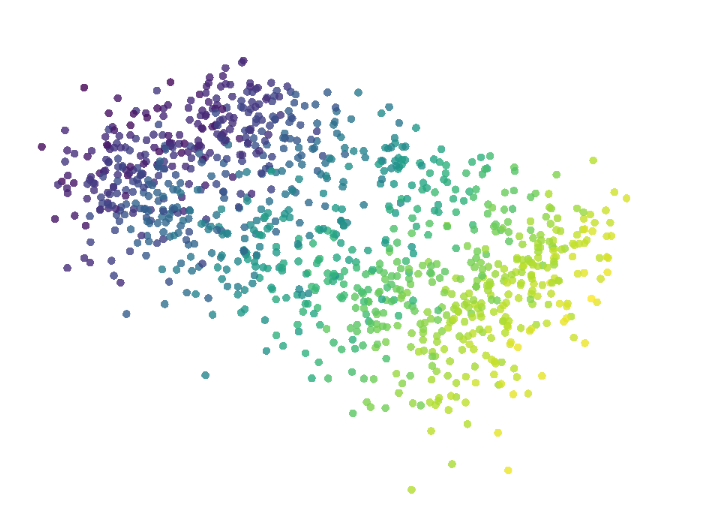

# Aether-3D: Unsupervised Variational Autoencoder for 3D Manifold Learning

[](https://opensource.org/licenses/MIT)
[](https://pytorch.org/)

## 1. Abstract
Aether-3D is a deep generative framework capable of learning continuous latent representations of 3D geometric data without supervision. Unlike discriminative models that map inputs to discrete labels, Aether-3D maps high-dimensional point clouds ($N=1024$) to a compressed probabilistic latent space ($z \in \mathbb{R}^{128}$).

By leveraging a Variational Autoencoder (VAE) architecture with a PointNet backbone, the system learns to reconstruct complex topologies while maintaining a regularized latent manifold. This allows for valid geometric interpolation ("morphing") between disparate objects, demonstrating that the model has learned the underlying structural parameters of the 3D data rather than simply memorizing training examples.

## 2. Theoretical Framework

### 2.1 Problem Formulation
The goal is to learn a parametric function $f(x)$ that maps a point cloud $X = \{P_1, ..., P_N\} \in \mathbb{R}^{N \times 3}$ to a low-dimensional distribution $q(z|x)$ and a generative function $g(z)$ that reconstructs $\hat{X}$ from a sample $z \sim q(z|x)$.

### 2.2 The Variational Objective
The model maximizes the Evidence Lower Bound (ELBO), which decomposes into two objective terms:

$$\mathcal{L} = \mathcal{L}_{recon} + \beta \cdot \mathcal{L}_{KL}$$

1.  **Reconstruction Loss (Chamfer Distance):**
    Since point clouds are permutation-invariant sets, standard Mean Squared Error (MSE) is invalid. We utilize the Chamfer Distance to measure the geometric discrepancy between the input set $S_1$ and reconstructed set $S_2$:
    $$d_{CD}(S_1, S_2) = \sum_{x \in S_1} \min_{y \in S_2} ||x - y||_2^2 + \sum_{y \in S_2} \min_{x \in S_1} ||x - y||_2^2$$

2.  **Regularization (KL-Divergence):**
    To ensure the latent space allows for smooth interpolation, we enforce a Gaussian prior $\mathcal{N}(0, I)$ on the learned distribution using Kullback-Leibler Divergence:
    $$D_{KL}(q(z|x) || p(z)) = -\frac{1}{2} \sum [1 + \log(\sigma^2) - \mu^2 - \sigma^2]$$

### 2.3 KL-Annealing
To prevent "posterior collapse" (where the decoder ignores the latent code), we implement a cyclical annealing schedule for the $\beta$ term. This allows the model to prioritize reconstruction accuracy in early epochs before gradually enforcing latent structure.

## 3. System Architecture

The architecture is designed for type-safety and modularity, consisting of two primary components:

### The Encoder (Probabilistic PointNet)
* **Input:** $(B, 3, 1024)$ Point Cloud.
* **Backbone:** Shared Multi-Layer Perceptrons (MLP) $(64, 128, 1024)$ extract local features per point.
* **Symmetric Function:** Global Max Pooling aggregates features into a permutation-invariant global descriptor.
* **Variational Heads:** Two parallel fully connected layers project the descriptor into mean ($\mu$) and log-variance ($\log \sigma^2$) vectors.

### The Decoder (Generative MLP)
* **Input:** $(B, 128)$ Latent Vector sampled via the Reparameterization Trick ($z = \mu + \epsilon \cdot \sigma$).
* **Structure:** A 3-layer MLP expands the code back to $N \times 3$ coordinate space.
* **Output:** $(B, 1024, 3)$ Reconstructed Point Cloud.

## 4. Experimental Results

The model was trained on the ModelNet10 dataset for 30 epochs using an Adam optimizer.

* **Final Reconstruction Loss:** 0.0208
* **Convergence:** Stable reduction in Chamfer Distance observed after Epoch 5, with KL-divergence stabilizing as $\beta \to 1.0$.
* **Visual Validation:** Latent space interpolation demonstrates smooth topological transitions between topologically distinct classes (e.g., Table to Bathtub).


*Figure 1: Generated manifold traversal showing the non-linear interpolation between two object classes.*

## 5. Installation and Usage

### Prerequisites
* Python 3.8+
* PyTorch 2.0+ (CUDA support recommended)
* Plotly (for visualization)

### Setup
```bash
git clone [https://github.com/stellaagbim/Aether-3D.git](https://github.com/stellaagbim/Aether-3D.git)
cd Aether-3D
pip install torch torch-geometric plotly tqdm

Training
To train the VAE from scratch using the unsupervised pipeline:
python train.py

--epochs: Default 30.

--batch_size: Default 32.

Artifacts: Best model weights are saved to checkpoints/aether_best.pth.

Inference (Dreaming)
To execute the latent space interpolation script and generate 3D visualizations:
python -m src.dream

Results will be generated as interactive HTML files in the root directory.
6. Project Structure
Aether-3D/
├── data/               # Raw ModelNet10 dataset (GitIgnored)
├── src/
│   ├── models.py       # VAE Architecture definition
│   ├── dataset.py      # Unsupervised data loading pipeline
│   ├── loss.py         # Custom Chamfer Loss & KL Divergence
│   └── dream.py        # Inference and interpolation engine
├── train.py            # Training loop with KL-annealing
└── README.md           # Documentation

7. Citation
If you use this framework in your research, please cite:
@software{agbim2026aether,
  author = {Stella Agbim},
  title = {Aether-3D: Unsupervised Latent Manifold Learning},
  year = {2026},
  url = {[https://github.com/stellaagbim/Aether-3D](https://github.com/stellaagbim/Aether-3D)}